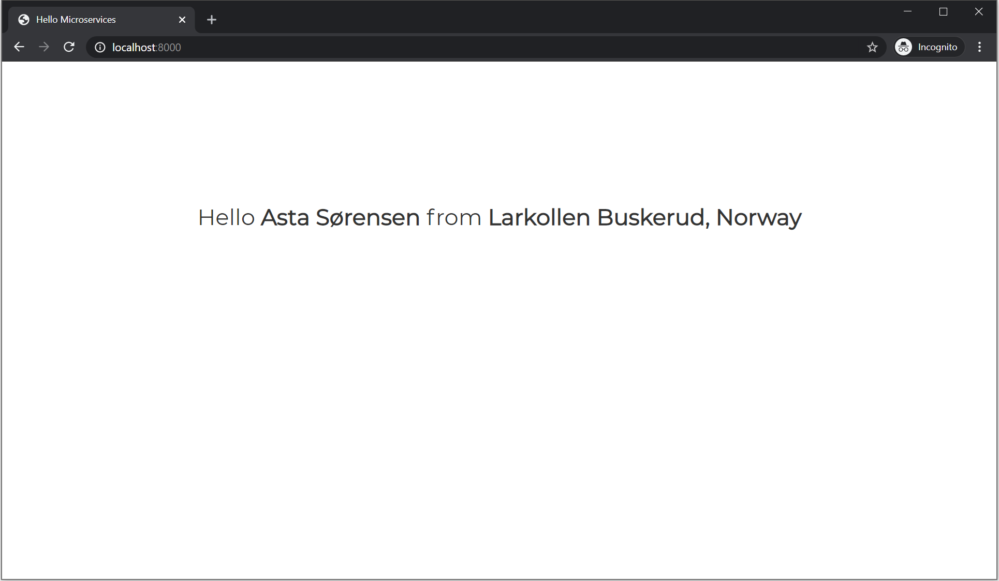

# Hello Micro Services

Hello World.. Using Micro Services 😎. It greets a Random Person from a Random Location

## Installation

First you need to install the Paket tool, The Install Packages before building the solution

```bash
# Install Paket CLI if not installed
dotnet tool install paket --global

# Install Application Packages
paket install

# Build entire solution
dotnet build
```

## Running the Application

1. Open Terminal
2. Change the directory to the `Hello.Person`
3. Execute `dotnet run`
4. Open Another Terminal
5. Change the directory to the `Hello.Location`
6. Execute `dotnet run`
7. Open Another Terminal
8. Change the directory to the `Hello.App`
9. Execute `dotnet run`


You can then proceed to http://localhost:8000 in your browser




This is meant to show an example of a micro-services application. It's written in F# using ASP.NET Core [Giraffe](https://github.com/giraffe-fsharp/Giraffe)


## Architecture
This application has a front-end and two micro-service backends namely

- App Service
- Location Service
- Person Service

### Person Service

This micro service returns a random person's name each time it's invoked

### Location Service

This micro service returns a random city and state each time it's invoked

### App Service

This is the front end that returns the greeting using data from both the Person service and the Location Service

